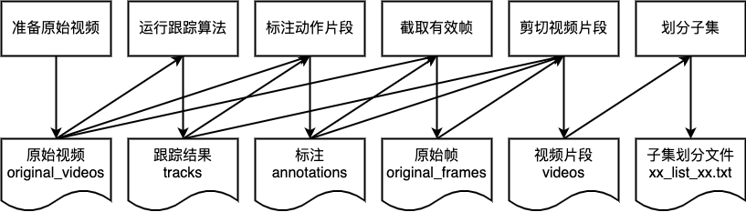

# 如何自行收集视频数据并标注

首先请进入mmaction攀爬数据处理脚本目录：
```
cd third_party/mmaction/data_tools/climbing
```

并定义数据集目录（mmaction的数据目录为`third_party/mmaction/data`，建议在这里建立子目录）：
```
export DATASET_PATH=/path/to/dataset    # 例如third_party/mmaction/data/climbing

export DATASET_NAME=/name/of/dataset    # 例如climbing
```

注：理论上支持任意多个类别的行为，不仅仅是攀爬一种。这里数据集称作climbing只是因为最初只做了攀爬行为的检测。

动作检测的数据标注较为困难，因此这里使用了先检测、跟踪再基于跟踪结果标注的方式。整体流程如下图：



上图中，仅最后的视频片段目录`videos`和子集划分文件`xxx_list_xxx.txt`二者会被mmaction使用，其他的中间结果都（尤其是原始帧）可以删除。


## 下载原始视频
在数据集目录下创建`original_videos`文件夹，用于保存原始视频文件：
```
mkdir $DATASET_PATH/original_videos
```
将原始视频下载至该目录下。OpenCV可读的格式均可。

## 生成初步跟踪结果
在数据集目录下创建`tracks`文件夹，用于保存跟踪结果：
```
mkdir $DATASET_PATH/tracks
```

要标注动作检测数据，首先需要运行多目标跟踪算法生成所有的track，再标注视频中的track ID和帧号区间。

对每个视频运行代码主目录下的`main.py`并生成跟踪结果：
```
python main.py track \
 --detector_config third_party/mmdetection/configs/faster_rcnn_r50_fpn_1x.py \
 --detector_checkpoint third_party/mmdetection/modelzoo/faster_rcnn_r50_fpn_1x_20181010-3d1b3351.pth \
 --tracker tracktor \
 --video_path $DATASET_PATH/original_videos/<video file name> \
 --save_video $DATASET_PATH/tracks/<video file name>.mp4 \
 --save_result $DATASET_PATH/tracks/<video file name>.txt
```

参数说明：
- `MODE MODE`：程序运行模式，"track"或"action"，即运行跟踪或跟踪+动作识别
- `--detector_config CONFIG`：mmdetection检测器的配置文件路径
- `--detector_checkpoint CHECKPOINT`：mmdetection检测器的权重文件路径
- `--tracker TRACKER`：使用的跟踪器，可选"tracktor"或"ioutracker"，前者效果更好，后者更快
- `--video_path VIDEO_PATH`：用于测试的视频
- `--save_video SAVE_VIDEO`：若非空，则会将demo输出的视频保存
- `--save_result SAVE_RESULT`：若非空，则会将跟踪结果保存为TXT格式

为了后面步骤的标注和剪切，请保留所有的输出视频和结果，并且保证每个视频和每个txt跟踪结果文件一一对应，即除了扩展名（如".mp4"，".txt"）以外的部分完全相同。txt文件放到tracks目录下。

## 标注动作片段
在数据集目录下建立`annotations`目录，用于存放对各类动作的标注：
```
mkdir $DATASET_PATH/annotations
```
在annotations目录中，为**每种动作**建立一个TXT文件（如climb.txt），用于标注训练视频中的动作片段。

以攀爬视频数据集的smkru1qqjAA.mp4为例，视频中56帧至137帧，4号目标存在攀爬动作（下图没有完全截到）：


则可在攀爬动作对应的标注文件中新增一行：
```
smkru1qqjAA.mp4 4 56 137
```

也就是说，标注文件每行的内容格式为：
```
<视频文件名> <目标ID> <目标动作开始帧号> <目标动作结束帧号>
```

注：
1. 动作的长度无需固定，可长可短。但为了达到较好的学习效果，应尽可能接近实际应用时进行帧采样的范围长度。在Demo程序中，采样的范围为从任一帧开始向前的30帧范围。
2. 除了感兴趣的动作类别（如攀爬）以外，还应收集一些不属于任何感兴趣的动作类别以外的动作片段。注意类别之间的数据平衡。

## 截取有效帧
在数据集目录下建立`original_frames`目录，用于存放有效的原始帧：
```
mkdir $DATASET_PATH/original_frames
```

原始视频的长度参差不齐，并且往往大部分帧是我们不感兴趣的。
在后续的步骤中，需要将视频转换为每一帧的图像，这将会占用大量磁盘空间。
因此，首先运行`extract_original_frames.py`来仅将感兴趣的帧保存下来：
```
python extract_original_frames.py \
 --annotation_file $DATASET_PATH/annotations/YOUR_ACTION.txt \
 --videos_dir $DATASET_PATH/original_videos \
 --output_dir $DATASET_PATH/original_frames
```
参数列表：
- `--annotation_file ANNOTATION_FILE`：某个动作类别的标注文件——请将`YOUR_ACTION.txt`替换为实际标注过的某动作类别标注文件
- `--videos_dir VIDEOS_DIR`：**所有**视频的存放**目录**
- `--output_dir OUTPUT_DIR`：有效帧的存放目录，这里**不同类别无需区分**

## 剪切视频片段
在数据集目录下建立`videos`目录，用于存放各个类别的动作实例片段：
```
mkdir $DATASET_PATH/videos
```
使用有效帧和标注文件，可以将每个动作实例剪切为视频。对每个动作类别运行`crop_video_patches.py`：
```
python crop_video_patches.py \
 --annotation_file $DATASET_PATH/annotations/YOUR_ACTION.txt \
 --rawframes_dir $DATASET_PATH/original_frames \
 --track_dir $DATASET_PATH/tracks \
 --output_dir $DATASET_PATH/videos
```
参数列表：
- `--annotation_file ANNOTATION_FILE`：某个动作类别的标注文件——请将`YOUR_ACTION.txt`替换为实际标注过的某动作类别标注文件
- `--rawframes_dir RAWFRAMES_DIR`：视频帧存放目录
- `--track_dir TRACK_DIR`：所有视频对应的跟踪结果存放目录
- `--output_dir OUTPUT_DIR`：剪切的视频片段输出目录
可选参数：
- `--video_size VIDEO_SIZE`：整数，截取视频帧的尺寸，默认为256；截取时会通过padding把剪切范围固定为正方形，并缩放为VIDEO_SIZE×VIDEO_SIZE的尺寸

## 随机划分子集
本步骤将在`annotations`目录新建3个txt文件`classInds.txt`、`trainlist01.txt`、`testlist01.txt`。运行`divide_splits.py`：
```
python divide_splits.py --data_root $DATASET_PATH
```

到此为止，训练mmaction的TSN动作分类模型的所有数据（视频、子集列表）已准备完毕，但mmaction仍有一些处理脚本需要运行。

## 使用mmaction的脚本处理

### 生成剪切帧
进入上一级目录`data_tools`，并运行`build_rawframes.py`脚本：
```
cd ..
python build_rawframes.py $DATASET_PATH/videos/ $DATASET_PATH/rawframes/ --level 2 --ext mp4
```
该脚本将自动建立`$DATASET_PATH/rawframes`目录并将每个视频片段逐帧保存。

### 生成文件列表
继续在上一级目录`data_tools`中运行`build_file_list.py`脚本。对rawframes和video各跑两遍，一遍为train list，一遍为val list：
```
python build_file_list.py $DATASET_NAME $DATASET_PATH/rawframes/ --dataset_path $DATASET_PATH --format rawframes --shuffle --num_split 1
python build_file_list.py $DATASET_NAME $DATASET_PATH/rawframes/ --dataset_path $DATASET_PATH --format rawframes --shuffle --num_split 1 --subset val

python build_file_list.py $DATASET_NAME $DATASET_PATH/videos/ --dataset_path $DATASET_PATH --format videos --shuffle --num_split 1
python build_file_list.py $DATASET_NAME $DATASET_PATH/videos/ --dataset_path $DATASET_PATH --format videos --shuffle --num_split 1 --subset val
```

注：`build_file_list.py`的第一个参数是数据集名称。该脚本将把文件列表保存在third_party/mmaction/data下以该名称命名的目录下。

参数列表：
- `DATASET`：数据集名称
- `FRAME_PATH`：保存剪切帧的目录
- `--dataset_path DATASET_PATH`：数据集目录
- `--rgb_prefix RGB_PREFIX`：RGB图像文件名前缀，默认为`img_`
- `--flow_x_prefix FLOW_X_PREFIX`：X方向光流文件名前缀，默认为`flow_x_`
- `--flow_y_prefix FLOW_Y_PREFIX`：Y方向光流文件名前缀，默认为`flow_y_`
- `--num_split NUM_SPLIT`：平均划分为多少个子集，默认为3，这里我们设置为1
- `--subset SUBSET`：子集名称，`train`、`val`或`test`
- `--level LEVEL`：文件夹目录层级，默认为2
- `--format FORMAT`：文件格式，`rawframes`或`videos`
- `--shuffle`：是否随机排序